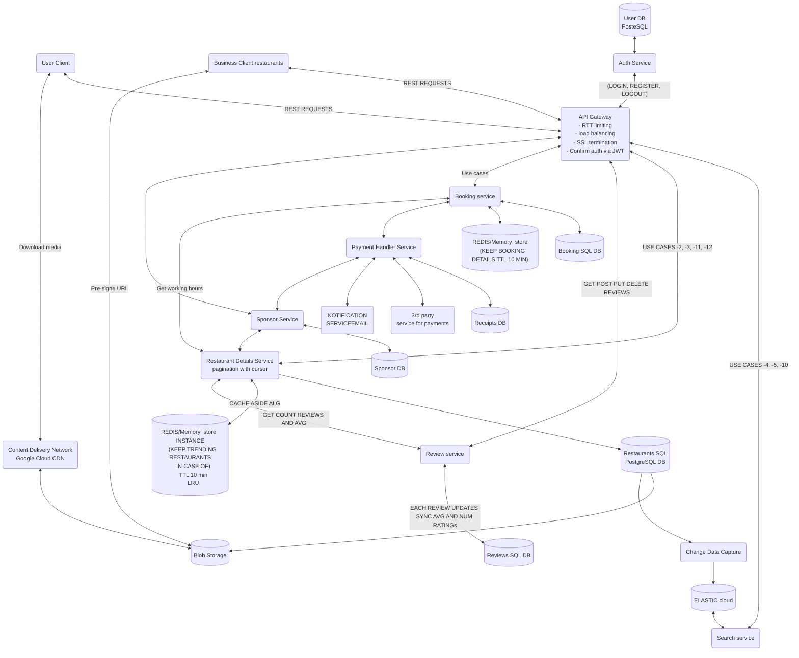

# FUNCTIONAL REQUIREMENTS
## USER CASES
### 1. Review a restaurant
#### Description
- Authenticated users should be able to create a review associated with their own ID of a restaurant of their choosing.
#### Parameters
- Rating from 1 to 5
- Comment (OPTIONAL)
#### System logic
- An authenticated user can only have one review per restaurant.
- Each new review should update the average rating and number of ratings of the associated restaurant.

### 2. Manage a review
#### Description
- Authenticated users should be able to edit and delete their own reviews on any given restaurant.
#### System logic
- Each edited/deleted review should update the average rating and number of ratings of the associated restaurant. 

### 3. See details of a restaurant
#### Description
- Authenticated users should be able to see any given restaurant's details.
#### System logic
- The user is shown the name, location, address, working hours, categories, average ratings, number of ratings, and, if available, media associated with the restaurant.
- The user is shown whether the restaurant is currently using the sponsor system or not.

### 4. See reviews of a restaurant
#### Description
- Authenticated users should be able to see the reviews that any given restaurant possesses.
#### System logic
- The response results are shown in pagination format.
- The pagination should have a maximum limit defined (for example, 30 reviews per page).
- Each review should contain the rating associated with it and the name of the user that posted it.

### 5. Search for nearby restaurants
#### Description
- The user should be able to get information about the nearest restaurants.
#### Parameters
- Restaurant categories (OPTIONAL)
- Restaurant prefix (OPTIONAL)
#### System logic
- The system takes the user's location and performs the search with it.
- The response results are shown in pagination format.
- The pagination should have a maximum limit defined (for example, 15 restaurants per page).
- If input by the user, the system should filter the found restaurants based on restaurant categories.
- If input by the user, the system should also return only the restaurants whose names match the given prefix.

### 6. Search for restaurants semantically
#### Description
- Authenticated users can search for restaurants given some parameters.
#### Parameters
- Restaurant categories
- Virtual categories
- Address
#### System logic
- At least one of the specified parameters is mandatory.
- The system should return a pagination response.
- The pagination should have a maximum limit defined (for example, 15 restaurants per page).

### 7. Users can see available booking slots
#### Description
- Authenticated users should be able to see the available booking slots for a given hour and restaurant.
#### Parameters
- Date
- Hour
#### System logic
- The response should contain the number of slots available for the input hour and the maximum number of slots avaible for that restaurant.

### 8. Users can search for available booking hours
#### Description
- Authenticated users should be able to search for hours that have a given number of available slots for a given restaurant.
#### Parameters
- Date
- Number of slots
#### System logic
- The system returns the available working hours associated with the restaurant that have a number of available slots equal or greater than the input given.

### 9. Users can book a reservation
#### Description
- Authenticated users can book a reservation for a certain hour in a given restaurant.
#### Parameters
- Date
- Hour
- Number of slots
#### System logic
- The number of slots (number of people) must be less or equal to the number of available slots for the given hour.
- The operation will fail if the user tries to book a reservation for the associated restaurant's non-working hours.

### 10. Users can create an account
#### Description
- Unauthenticated users should be able to create an account to start using the application.
#### Parameters
- Username
- Email
- Password
#### System logic
- Unauthenticated users should not be able to use any of the application's services.
- All paths (excluding /auth) are blocked to unathenticated users.

### 11. Users can login
#### Description
- Unauthenticated users should be able to login to the application.
#### Parameters
- Username
- Password
#### System logic
- Unauthenticated users should not be able to use any of the application's services.
- All paths (excluding /auth) are blocked to unathenticated users.
- If a user doesn't have an account, they are given an option to create one by registering.

### 12. Users can logout
#### Description
- Authenticated users should be able to logout of the application.
#### System logic
- Authenticated users that logout become unauthenticated.
- Unauthenticated users should not be able to use any of the application's services.
- All paths (excluding /auth) are blocked to unathenticated users.

### 13. Users will get notifications if their payments are validated or not.
#### Description
- Authenticated users will get emails from validated or failed (pending?) payments.

### 14. Users can compare restaurant details
- Authenticated users shoud be able to (ver disto)

### 15. Users can search similar restaurants
#### Description
- Authenticated users can search for similar restaurants, based on any given restaurant.
#### Parameters
- Restaurant name/ID/details (confirmar)
#### System logic
- The system searches for restaurants with similar attributes based on the user's input.
- The response results are shown in pagination format.
- The pagination should have a maximum limit defined (for example, 15 restaurants per page).

---
## BUSINESS USER CASES
### 1. Create a restaurant
#### Description
- Authenticated business users should be able to create a new restaurant entry.
#### Parameters
- Name
- Location
- Working hours
- Categories
- Sponsor details
- Media URL (OPTIONAL)
#### System logic
- If the restaurant is created with any sponsor tier, the system gives it benefits (ver disto).

### 2. Manage a restaurant
#### Description
- Authenticated business users should be able to edit or delete their own restaurant entries.
#### System logic
-The system can only allow changes to the restaurant scheduled to at least one week to not conflict with already existing bookings. 

### 3. Sponsor restaurant
#### Description
- Authenticated business users should be able to sponsor their own restaurants.
#### Parameters
- Sponsor tier
- Sponsor categories[]
#### System logic
- The system must bill the business users monthly for their sponsored restaurants.
- Sponsored restaurants receive search benefits of their choosing, they will appear at the top of searches when someones searches for a common prefix or chooses a category that they paid to be sponsored .

Mermaid diagram: 
