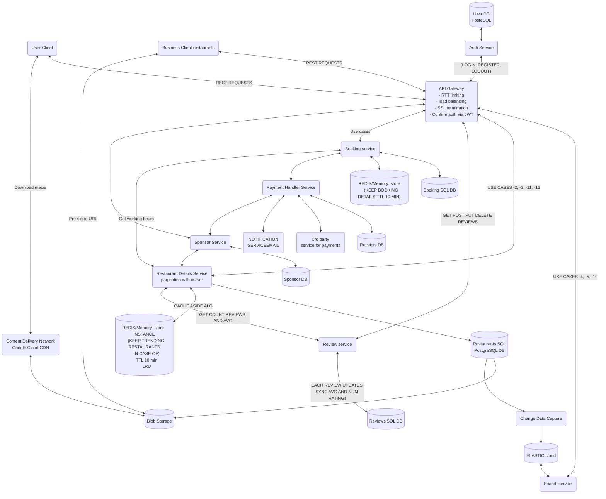

```mermaid
flowchart TD
    UserClient("User Client")
    BusinessClient("Business Client restaurants")
    ApiGateway("API Gateway<br/>- RTT limiting<br/>- load balancing<br/>- SSL termination<br/>- Confirm auth via JWT")
    AuthService("Auth Service")
    UserDB[("User DB
    PosteSQL")]
    CDN("Content Delivery Network<br/>Google Cloud CDN")
    BlobStorage[("Blob Storage")]
    RestaurantsDB[("Restaurants SQL
    PostgreSQL DB")]
    ChangeDataCapture("Change Data Capture")
    ElasticCloud[("ELASTIC cloud")]
    SearchService("Search service")
    ReastaurantDetailsService("Restaurant Details Service<br/>pagination with cursor")
    RedisInstanceTrendingRestaurants[("REDIS/Memory  store  INSTANCE
    (KEEP TRENDING RESTAURANTS
    IN CASE OF)
    TTL 10 min
    LRU")]
    ReviewService("Review service")
    ReviewsDB[("Reviews SQL DB")]
    BookingService("Booking service")
    BookingDB[("Booking SQL DB")]
    RedisInstanceBooking[("REDIS/Memory  store
    (KEEP BOOKING DETAILS TTL 10 MIN)")]
    PaymentService("Payment Handler Service")
    3rdPartyService("3rd party<br/>service for payments")
    Notifications("NOTIFICATION<br/>SERVICEEMAIL")
    ReceiptsDB[("Receipts DB")]
    SponsorService("Sponsor Service")
    SponsorDB[("Sponsor DB")]

    UserDB <--> AuthService
    AuthService <-- (LOGIN, REGISTER, LOGOUT) --> ApiGateway

    UserClient <-- "REST REQUESTS" --> ApiGateway
    UserClient <-- "Download media" --> CDN

    CDN <--> BlobStorage
    BusinessClient <-- "REST REQUESTS" --> ApiGateway
    BusinessClient <-- "Pre-signe URL" --> BlobStorage

    ApiGateway <-- "USE CASES -4, -5, -10" --> SearchService
    ApiGateway <-- "USE CASES -2, -3, -11, -12" --> ReastaurantDetailsService
    ApiGateway <-- "GET POST PUT DELETE REVIEWS" --> ReviewService
    ApiGateway <-- "Use cases" --> BookingService
    ApiGateway <--> SponsorService
  

    RestaurantsDB --> BlobStorage

    RestaurantsDB --> ChangeDataCapture
    ChangeDataCapture --> ElasticCloud

    ReastaurantDetailsService --> RestaurantsDB
    ReastaurantDetailsService <-- "CACHE ASIDE ALG" --> RedisInstanceTrendingRestaurants
    ReastaurantDetailsService <-- "GET COUNT REVIEWS AND AVG" --> ReviewService

    ElasticCloud <--> SearchService

    ReviewService <-- "EACH REVIEW UPDATES SYNC AVG AND NUM RATINGs" -->  ReviewsDB

    BookingService <--> BookingDB
    BookingService <--> RedisInstanceBooking
    BookingService <--> PaymentService
    BookingService <-- "Get working hours" --> ReastaurantDetailsService

    PaymentService <--> ReceiptsDB
    PaymentService <--> 3rdPartyService
    PaymentService <--> Notifications
    PaymentService <--> SponsorService

    SponsorService <--> SponsorDB
    SponsorService <--> ReastaurantDetailsService
```