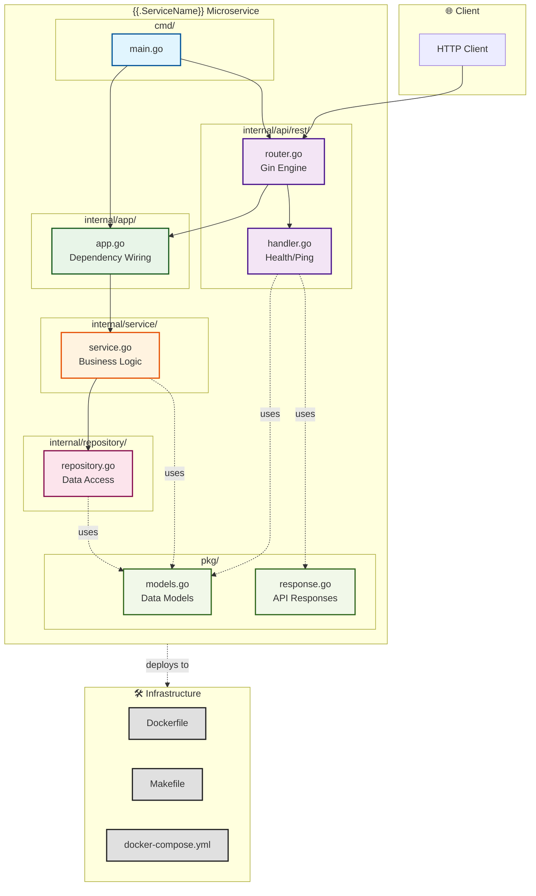

```mermaid
flowchart TD
subgraph Client["🌐 Client"]
HTTP[HTTP Client]
end

    subgraph Microservice["{{.ServiceName}} Microservice"]
        subgraph Entry["cmd/"]
            Main[main.go]
        end

        subgraph API["internal/api/rest/"]
            Router[router.go<br/>Gin Engine]
            Handler[handler.go<br/>Health/Ping]
        end

        subgraph AppLayer["internal/app/"]
            App[app.go<br/>Dependency Wiring]
        end

        subgraph BusinessLayer["internal/service/"]
            BizService[service.go<br/>Business Logic]
        end

        subgraph DataLayer["internal/repository/"]
            Repo[repository.go<br/>Data Access]
        end

        subgraph Shared["pkg/"]
            Models[models.go<br/>Data Models]
            Response[response.go<br/>API Responses]
        end
    end

    subgraph Infra["🛠 Infrastructure"]
        Docker[Dockerfile]
        Makefile[Makefile]
        Compose[docker-compose.yml]
    end

    %% Dependency Flow (Service-only pattern)
    HTTP --> Router
    Main --> Router
    Main --> App
    Router --> Handler
    Router --> App
    App --> BizService
    BizService --> Repo
    Handler -.->|uses| Models
    Handler -.->|uses| Response
    BizService -.->|uses| Models
    Repo -.->|uses| Models

    %% Infrastructure
    Microservice -.->|deploys to| Infra

    %% Styling
    classDef entry fill:#e1f5fe,stroke:#01579b,stroke-width:2px
    classDef api fill:#f3e5f5,stroke:#4a148c,stroke-width:2px
    classDef appLayer fill:#e8f5e8,stroke:#1b5e20,stroke-width:2px
    classDef businessLayer fill:#fff3e0,stroke:#e65100,stroke-width:2px
    classDef dataLayer fill:#fce4ec,stroke:#880e4f,stroke-width:2px
    classDef shared fill:#f1f8e9,stroke:#33691e,stroke-width:2px
    classDef infra fill:#e0e0e0,stroke:#212121,stroke-width:2px

    class Main entry
    class Router,Handler api
    class App appLayer
    class BizService businessLayer
    class Repo dataLayer
    class Models,Response shared
    class Docker,Makefile,Compose infra
```
